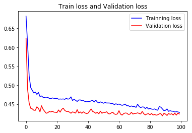
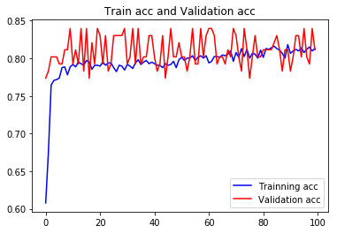

# 使用MLP（多层感知机）来预测Titani乘客的生存概率，使用Keras框架
# titanic survival prediction
利用神经网络的MLP(多层感知机)来预测Titanic上乘客的生存概率，MLP是多层神经元这里通过多层神经元来预测。
## 数据预处理
首先读取数据，数据位于data/titanic3.csv。首先导入相关的库来读入数据

``` 
import numpy as np
import pandas as pd
data_path='data/titanic3.xls'
df=pd.read_excel(data_path)
```
这里展示一下数据，我们这里展示前五行的数据看看数据的格式

```
pclass	survived	name	sex	age	sibsp	parch	ticket	fare	cabin	embarked	boat	body	home.dest
0	1	1	Allen, Miss. Elisabeth Walton	female	29.0	0	0	24160	211.3375	B5	S	2	NaN	St Louis, MO
1	1	1	Allison, Master. Hudson Trevor	male	28.0	1	2	113781	151.5500	C22 C26	S	11	NaN	Montreal, PQ / Chesterville, ON
2	1	0	Allison, Miss. Helen Loraine	female	27.0	1	2	113781	151.5500	C22 C26	S	NaN	NaN	Montreal, PQ / Chesterville, ON
3	1	0	Allison, Mr. Hudson Joshua Creighton	male	30.0	1	2	113781	151.5500	C22 C26	S	NaN	135.0	Montreal, PQ / Chesterville, ON
4	1	0	Allison, Mrs. Hudson J C (Bessie Waldo Daniels)	female	25.0	1	2	113781	151.5500	C22 C26	S	NaN	NaN	Montreal, PQ / Chesterville, ON
```
从上面的数据中可以看出，主要记录了乘客的船舱的类别pclass,survived(生存),name(姓名),sex(性别),age(年龄),parch,fare,embarked等相关的信息。这里我们要按照常理思考。如姓名，船票号码，船位号码以及目的地这些字段对乘客的生存关系不大，故我们可以将这些数据忽略掉。同时这里有个小技巧。我们要预测的survived字段，这里最好将其放在第一列上以便后面的处理，同时我们可以拼接个list来存放我们要读取的列。

```
cols=['survived','name','pclass','sex','age','sibsp','parch','fare','embarked']
```

**这里要强调一下机器学习中数据处理中常见的情形：神经网络中不能有空值，对于数值为空的数据我们将这些数据填充完整，对于二分类的类别如性别我们要将其转换为0和1。对于分类字段我们还必须使用One-hot-Encoding进行转换。只有这样我们才能送进机器中进行学习**

这里先检查一下数据的整体情况看看有多少为空

```
df.isnull().sum()
survived      0
name          0
pclass        0
sex           0
age         263
sibsp         0
parch         0
fare          1
embarked      2
```
可以看出年龄字段有263行空缺，fare有1个空缺，embarked有两项空缺。这些空缺的值是不能直接送进神经网络中进行计算的，这里我们将年龄的空缺值填充为年龄的平均值，fare的空缺也填充为平均值。

```
age_mean=df['age'].mean()
df['age']=df['age'].fillna(age_mean)
fare_mean=df['fare'].mean()
df['fare']=df['fare'].fillna(fare_mean)
```
对于性别为字符female和male的这种情况，神经网络是不允许字符的我们必须将它转换为数字0和1

```
df['sex']=df['sex'].map({'female':0,'male':1}).astype(int)
```
对于embarked字段是个类别我们要将其转换为一位有效编码转换即转换为One-Hot-Encoding，这里使用get_dummies()进行转换即可，get_dummies(data,columns)data为要转换的DataFrame,columns要转换的字段

```
x_OneHot_df=pd.get_dummies(data=df,columns=['embarked'])
```
转换后的数据为：

```
survived	pclass	sex	age	sibsp	parch	fare	embarked_C	embarked_Q	embarked_S
0	1	1	0	29.000000	0	0	211.3375	0	0	1
1	1	1	1	28.000000	1	2	151.5500	0	0	1
2	0	1	0	27.000000	1	2	151.5500	0	0	1
3	0	1	1	30.000000	1	2	151.5500	0	0	1
4	0	1	0	25.000000	1	2	151.5500	0	0	1
5	1	1	1	48.000000	0	0	26.5500	0	0	1
```

因为后续要进行深度学习训练，所以必须将DataFrame转换为Array数组才可以进行训练，将DataFrame转换为Array也非常的简单,通过values转换一下即可。

```
dataset=x_OneHot_df.values
```
这里将数据可视化一下，我们只展示前两项的数据：

```
dataset[:2]
array([[1, 'Allen, Miss. Elisabeth Walton', 1, 0, 29.0, 0, 0, 211.3375,
        0, 0, 1],
       [1, 'Allison, Master. Hudson Trevor', 1, 1, 28.0, 1, 2, 151.55, 0,
        0, 1]], dtype=object)
```
其中第0个字段为label，第一个字段及以后的字段为features。我们要将数据划分label和features这里可以通过python的切片splice来实现。

```
Label=dataset[:,0]
Features=dataset[:,1:]
```
从以上的数据可以看出，因为数值特征字段单位不同，例如年龄29岁、运费211元等，数值差异很大，没有一个共同的标准。这时候我们要使用标准化让所有的数值都在0和1之间。即均值为0方差为1即数据标准化。我们都知道神经网络喜欢小数据。尤其是对sigmoid和tanh这类的激活函数，如果数值过大极易可能的造成梯度爆炸和梯度消失。我们将使用sklearn这个库对数据进行标准化。**这里必须强调一下我们只能对features进行标准化不能对label进行标准化**

```
from sklearn import preprocessing
minmax_scale=preprocessing.MinMaxScaler(feature_range=(0,1))
scaledFeatures=minmax_scale.fit_transform(Features)
```
转换后的数据如下：

```
scaledFeatures[:2]
array([[0.        , 0.        , 0.36116884, 0.        , 0.        ,
        0.41250333, 0.        , 0.        , 1.        ],
       [0.        , 1.        , 0.34864273, 0.125     , 0.22222222,
        0.2958059 , 0.        , 0.        , 1.        ]])
```
下面就是划分数据集，我们划分数据为训练数据集和测试数据集，这里我们选择80%的作为训练数据剩下的作为测试数据。

```
import numpy as np
msk=np.random.rand(len(df))<0.8
train=df[msk]
test=df[~msk]
print('total:{},train:{},test:{}'.format(len(df),len(train),len(test)))
total:1309,train:1045,test:264
```
这里我们将数据的预处理部分封装成一个函数以方便后面的调用，这点很重要后面我们会说明这种方式的重要性。

```
def preprocessData(df):
    df=df.drop(['name'],axis=1)
    age_mean=df['age'].mean()
    df['age']=df['age'].fillna(age_mean)
    fare_mean=df['fare'].mean()
    df['fare']=df['fare'].fillna(fare_mean)
    df['sex']=df['sex'].map({'female':0,'male':1}).astype(int)
    x_OneHot_df=pd.get_dummies(data=df,columns=['embarked'])
    ndarray=x_OneHot_df.values
    Features=ndarray[:,1:]
    Label=ndarray[:,0]
    minmax_scal=preprocessing.MinMaxScaler(feature_range=(0,1))
    scaledFeatures=minmax_scal.fit_transform(Features)
    return scaledFeatures,Label
```
获得标签和特征

```
train_features,train_label=preprocessData(train)
test_features,test_lable=preprocessData(test)
```
相比较数据的预处理阶段，构建模型就显得非常的简单了。接下来就用MLP构建我们的模型

```
model=Sequential()
model.add(Dense(128,input_dim=9,kernel_initializer='uniform',activation='relu'))
model.add(Dense(64,kernel_initializer='uniform',activation='relu'))
model.add(Dense(1,kernel_initializer='uniform',activation='sigmoid'))
```
对于一个二分类的问题这里选择的损失函数为**binary_crossentropy**

```
model.compile(loss='binary_crossentropy',optimizer='adam',metrics=['accuracy'])
```
下面开始训练

```
train_history=model.fit(train_features,train_label,validation_split=0.1,epochs=100,batch_size=32,verbose=1)
```
这里将训练过程可视化一下就可以很清楚的了解训练的具体情况

```
#将数据可视化一下
import matplotlib.pyplot as plt
loss=train_history.history['loss']
val_loss=train_history.history['val_loss']
acc=train_history.history['acc']
val_acc=train_history.history['val_acc']
epochs=range(0,len(loss))
plt.title("Train loss and Validation loss")
plt.plot(epochs,loss,'b',label='Trainning loss')
plt.plot(epochs,val_loss,'r',label='Validation loss')
plt.legend(loc='best')
plt.figure()
plt.title("Train acc and Validation acc")
plt.plot(epochs,acc,'b',label='Trainning acc')
plt.plot(epochs,val_acc,'r',label='Validation acc')
plt.legend(loc='best')
plt.show()
```
训练数据如下所示：




最后这里我们获取一下总得分

```
scores=model.evaluate(test_features,test_lable)
```
最终得分为scores[1]=0.8143,
最终在测试集的正确率为81%

## 预测新数据
这里我们要预测新增的数据可以通过下面的方式来进行增加

```
Jack=pd.Series([1,'Jack',3,'male',23,1,0,5.0000,'S'])
Rose=pd.Series([0,'Rose',1,'female',20,1,0,100.000,'S'])
```
使用pd.DataFrame创建Pandas DataFrame加入上述数据

```
JR_df=pd.DataFrame([list(Jack),list(Rose)],columns=['survived','name','pclass','sex','age','sibsp','parch','fare','embarked'])
```
将上述新增加的数据添加到原有的表中：

```
df=pd.concat([df,JR_df])
```
**这里一定要注意一下，我们要预测新数据则必须将数据与训练数据同样的标准化即使用同一个缩放因子scaler，不然是没有意义的。就像我们在中国直接使用美元来评估购买力一样，我们必须将其转换为人民币才有评估的价值**

这就是前面我们定义preprocessData的重要性，下面我们将所有的数据在进行数据预处理：

```
all_Feature,Label=preprocessData(df)
all_class=model.predict_classes(all_Feature)
```
接下来我们将df(姓名与所有的特征字段)与all_probality整合产生新的df

```
pd=df
pd.insert(len(df.columns),'probability',all_probalility)
```
接下来前100个数据如下：

```
survived	name	pclass	sex	age	sibsp	parch	fare	embarked	probability
0	1	Allen, Miss. Elisabeth Walton	1	female	29.0	0	0	211.3375	S	1
1	1	Allison, Master. Hudson Trevor	1	male	28.0	1	2	151.5500	S	1
2	0	Allison, Miss. Helen Loraine	1	female	27.0	1	2	151.5500	S	1
3	0	Allison, Mr. Hudson Joshua Creighton	1	male	30.0	1	2	151.5500	S	1
4	0	Allison, Mrs. Hudson J C (Bessie Waldo Daniels)	1	female	25.0	1	2	151.5500	S	1
5	1	Anderson, Mr. Harry	1	male	48.0	0	0	26.5500	S	0
6	1	Andrews, Miss. Kornelia Theodosia	1	female	63.0	1	0	77.9583	S	1
7	0	Andrews, Mr. Thomas Jr	1	male	39.0	0	0	0.0000	S	0
8	1	Appleton, Mrs. Edward Dale (Charlotte Lamson)	1	female	53.0	2	0	51.4792	S	1
9	0	Artagaveytia, Mr. Ramon	1	male	71.0	0	0	49.5042	C	0
10	0	Astor, Col. John Jacob	1	male	47.0	1	0	227.5250	C	0
11	1	Astor, Mrs. John Jacob (Madeleine Talmadge Force)	1	female	18.0	1	0	227.5250	C	1
12	1	Aubart, Mme. Leontine Pauline	1	female	24.0	0	0	69.3000	C	1
13	1	Barber, Miss. Ellen "Nellie"	1	female	26.0	0	0	78.8500	S	1
14	1	Barkworth, Mr. Algernon Henry Wilson	1	male	80.0	0	0	30.0000	S	0
15	0	Baumann, Mr. John D	1	male	NaN	0	0	25.9250	S	0
16	0	Baxter, Mr. Quigg Edmond	1	male	24.0	0	1	247.5208	C	0
17	1	Baxter, Mrs. James (Helene DeLaudeniere Chaput)	1	female	50.0	0	1	247.5208	C	1
18	1	Bazzani, Miss. Albina	1	female	32.0	0	0	76.2917	C	1
19	0	Beattie, Mr. Thomson	1	male	36.0	0	0	75.2417	C	0
20	1	Beckwith, Mr. Richard Leonard	1	male	37.0	1	1	52.5542	S	1
21	1	Beckwith, Mrs. Richard Leonard (Sallie Monypeny)	1	female	47.0	1	1	52.5542	S	1
22	1	Behr, Mr. Karl Howell	1	male	26.0	0	0	30.0000	C	0
23	1	Bidois, Miss. Rosalie	1	female	42.0	0	0	227.5250	C	1
24	1	Bird, Miss. Ellen	1	female	29.0	0	0	221.7792	S	1
25	0	Birnbaum, Mr. Jakob	1	male	25.0	0	0	26.0000	C	1
26	1	Bishop, Mr. Dickinson H	1	male	25.0	1	0	91.0792	C	0
27	1	Bishop, Mrs. Dickinson H (Helen Walton)	1	female	19.0	1	0	91.0792	C	1
28	1	Bissette, Miss. Amelia	1	female	35.0	0	0	135.6333	S	1
29	1	Bjornstrom-Steffansson, Mr. Mauritz Hakan	1	male	28.0	0	0	26.5500	S	0
...	...	...	...	...	...	...	...	...	...	...
70	0	Chisholm, Mr. Roderick Robert Crispin	1	male	NaN	0	0	0.0000	S	1
71	0	Clark, Mr. Walter Miller	1	male	27.0	1	0	136.7792	C	0
72	1	Clark, Mrs. Walter Miller (Virginia McDowell)	1	female	26.0	1	0	136.7792	C	1
73	1	Cleaver, Miss. Alice	1	female	22.0	0	0	151.5500	S	1
74	0	Clifford, Mr. George Quincy	1	male	NaN	0	0	52.0000	S	0
75	0	Colley, Mr. Edward Pomeroy	1	male	47.0	0	0	25.5875	S	0
76	1	Compton, Miss. Sara Rebecca	1	female	39.0	1	1	83.1583	C	1
77	0	Compton, Mr. Alexander Taylor Jr	1	male	37.0	1	1	83.1583	C	1
78	1	Compton, Mrs. Alexander Taylor (Mary Eliza Ing...	1	female	64.0	0	2	83.1583	C	1
79	1	Cornell, Mrs. Robert Clifford (Malvina Helen L...	1	female	55.0	2	0	25.7000	S	1
80	0	Crafton, Mr. John Bertram	1	male	NaN	0	0	26.5500	S	0
81	0	Crosby, Capt. Edward Gifford	1	male	70.0	1	1	71.0000	S	0
82	1	Crosby, Miss. Harriet R	1	female	36.0	0	2	71.0000	S	1
83	1	Crosby, Mrs. Edward Gifford (Catherine Elizabe...	1	female	64.0	1	1	26.5500	S	1
84	0	Cumings, Mr. John Bradley	1	male	39.0	1	0	71.2833	C	0
85	1	Cumings, Mrs. John Bradley (Florence Briggs Th...	1	female	38.0	1	0	71.2833	C	1
86	1	Daly, Mr. Peter Denis	1	male	51.0	0	0	26.5500	S	0
87	1	Daniel, Mr. Robert Williams	1	male	27.0	0	0	30.5000	S	0
88	1	Daniels, Miss. Sarah	1	female	33.0	0	0	151.5500	S	1
89	0	Davidson, Mr. Thornton	1	male	31.0	1	0	52.0000	S	1
90	1	Davidson, Mrs. Thornton (Orian Hays)	1	female	27.0	1	2	52.0000	S	1
91	1	Dick, Mr. Albert Adrian	1	male	31.0	1	0	57.0000	S	1
92	1	Dick, Mrs. Albert Adrian (Vera Gillespie)	1	female	17.0	1	0	57.0000	S	1
93	1	Dodge, Dr. Washington	1	male	53.0	1	1	81.8583	S	0
94	1	Dodge, Master. Washington	1	male	4.0	0	2	81.8583	S	1
95	1	Dodge, Mrs. Washington (Ruth Vidaver)	1	female	54.0	1	1	81.8583	S	1
96	0	Douglas, Mr. Walter Donald	1	male	50.0	1	0	106.4250	C	0
97	1	Douglas, Mrs. Frederick Charles (Mary Helene B...	1	female	27.0	1	1	247.5208	C	1
98	1	Douglas, Mrs. Walter Donald (Mahala Dutton)	1	female	48.0	1	0	106.4250	C	1
99	1	Duff Gordon, Lady. (Lucille Christiana Sutherl...	1	female	48.0	1	0	39.6000	C	1
```
